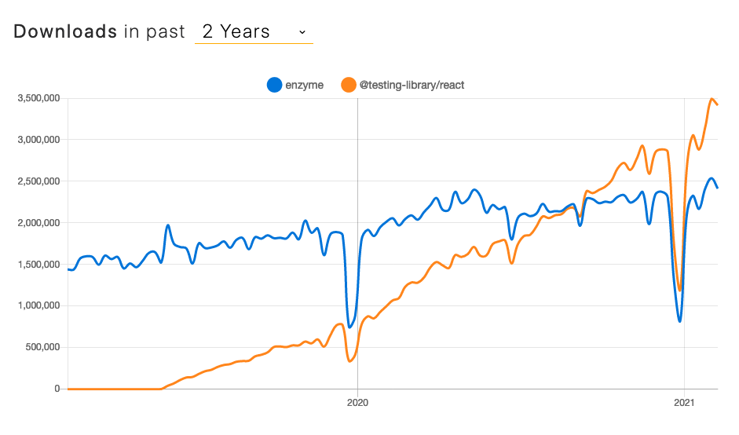

## `@testing-library/react`

- Encourages better testing practices by using **ARIA roles**
- Tests work with actual DOM nodes
- Internal React API is not publicly accessible
- "Shallow" rendering is still possible via mocking

---

## `enzyme` vs. `@testing-library/react`

